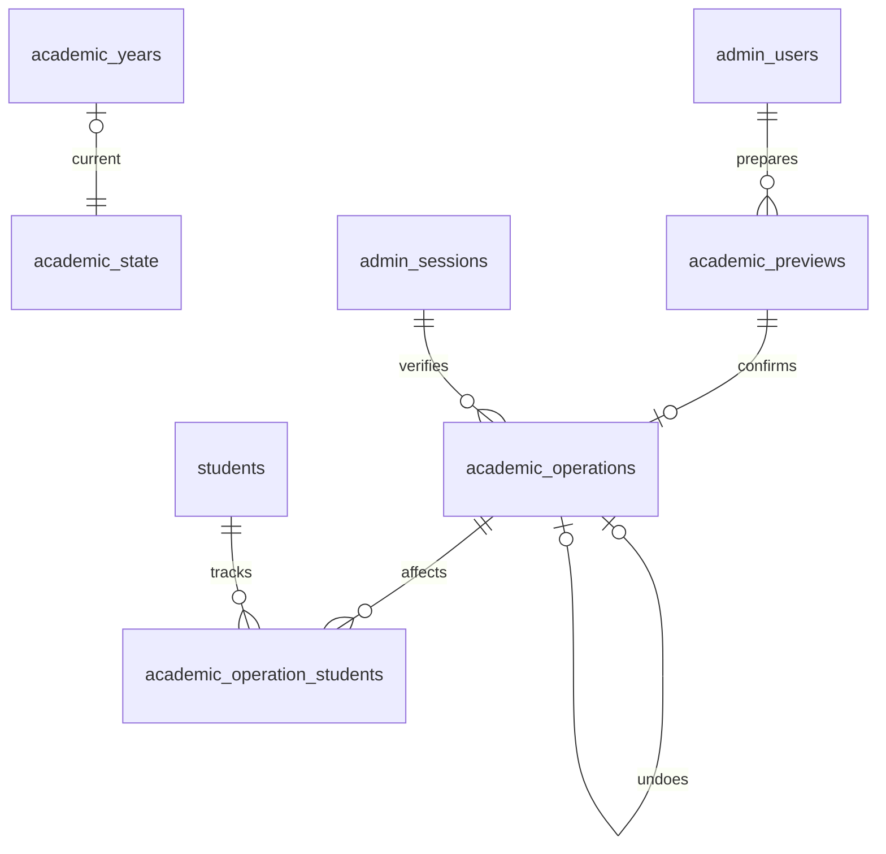
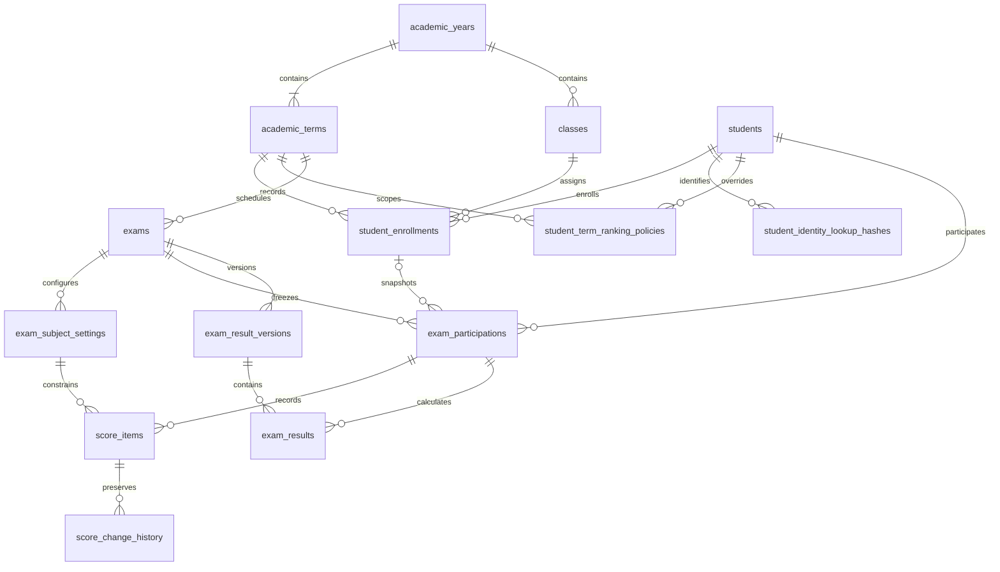
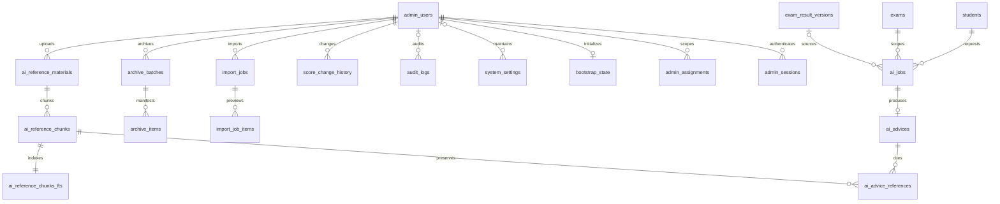

# 資料模型與 Migration

本文件記錄已實作的資料表示與本機驗證方式。業務規則仍以 [PROJECT_SPEC.md](../PROJECT_SPEC.md) 為準；本文件不授權 Production migration、部署或下一 Phase。基底證據見 [Phase 1 紀錄](PHASE_1.md)，現行學籍服務及升級證據見 [Phase 2 紀錄](PHASE_2.md)。

## 模型入口

- [Drizzle schema](../site/db/schema.ts)：42 張關聯表的欄位、外鍵、CHECK 與索引。
- [核心 migration](../site/drizzle/0000_phase_01_core.sql)：建立關聯表及索引。
- [跨列約束與 FTS migration](../site/drizzle/0001_phase_01_invariants.sql)：學籍、快照、管理員與版本約束，及 FTS 邏輯表 `ai_reference_chunks_fts`。FTS 內部 shadow tables 不另算業務表。
- [Migration journal](../site/drizzle/meta/_journal.json)：Drizzle 的順序與時間戳；snapshot 記錄可生成的關聯 schema，FTS／trigger 保存在 custom migration。
- [虛構 seed](../site/db/seed-fictional.ts)：四名虛構學生、同名同生日案例、轉班、晚轉入、原校成績、0 分與缺考。只供隔離測試使用，不隨 migration 執行，也不建立管理員、登入 Session 或 Bootstrap 完成紀錄。

## Phase 2 擴充

Phase 2 擴充學籍命令表；目前含 Phase 8 共 42 張關聯表加 FTS5。新增 [0002](../site/drizzle/0002_phase_02_academic_commands.sql)／[0003](../site/drizzle/0003_phase_02_academic_guards.sql)，原 0000／0001 保持不變。`academic_state` 保存目前年度與 revision；`academic_previews` 保存 actor、範圍及待確認計畫；`academic_operations` 保存 receipt／撤銷關聯；`academic_operation_students` 以 FK 追蹤受影響學生。



內部服務只接受 server-created Preview；Confirm 在同一 batch 保存變更、操作與 Audit，並清空已提交 Preview 的建檔 payload。未確認資料的保存／Purge、真實授權 adapter 及雲端部署依後續 Phase 關卡；詳細欄位與限制見 [Phase 2 紀錄](PHASE_2.md)。`npm run db:verify` 現在套用八份 migration；下文的既有 Phase 1 模型與安全契約仍適用。

## Phase 3A 認證狀態

`auth_oauth_states` 保存 state、nonce 與 PKCE verifier 的 SHA-256 hash、用途、到期與消費時間；瀏覽器短期 HttpOnly cookie 才帶回原值。Phase 3A 的用途為 `login`／`bootstrap`；Phase 3B 另加入 `reauth`／`identity`，migration trigger 檢查對應 Session／核准 request，禁止改換已建立 state 的用途。OAuth code、ID token、Session 原值與 Bootstrap Secret 不進 D1 或 Audit；管理員登入後只保存 Session token hash。OIDC 驗證與服務邊界見 [Phase 3A 紀錄](PHASE_3A.md)。

## Phase 3B 授權與身分異動

[0006 migration](../site/drizzle/0006_phase_03b_authorization.sql) 新增 auth_identity_requests，保存一次性 request token hash、核准 Email、kind、目標 auth_version、操作人 Session 或受控維護核准參照、5 分鐘效期與消費狀態；不保存 Recovery Secret。管理員 Session 新增 recent_auth_at（UTC 毫秒），取自已驗證 Google auth_time；既有 Session 升級後預設 0，必須重新驗證才能做高風險操作。

OAuth state 新增 admin_session_id／identity_request_id。升級只新增欄位並替換用途 trigger，不重建或刪除舊 state；生成 snapshot 與實際 schema 欄位一致，跨表／用途規則由 migration trigger 管理。已提交 migration 0000～0005 不變。

帳號及 Scope 異動先在同一 D1 batch 的 Audit insert 驗證操作者與目標版本，失敗使整筆交易回滾；唯一索引及既有最後管理員／Session 撤銷 trigger 維持生效。Recovery 完成在相同交易驗證尚未消費 request、更新綁定、撤銷 Sessions、消費 request 與 Audit。

本機驗證從 Phase 3A 六份 migration 升級，保留既有 OAuth state、外鍵及完整性；若應用版本回退，不刪除已套用 migration，回退程式仍須使用相容的新增欄位。Production 備份／復原與 migration 仍須另行 preflight 及人工確認。

## Phase 4 評量命令

[0007 migration](../site/drizzle/0007_phase_04_exam_commands.sql) 新增 exam_roster_previews 與 exam_operations。前者保存操作人、評量／班級、評量版本、學籍 revision 及伺服器解析的資格／班級快照；後者保存不可重複的 operationId、actor／Session、request hash、結果及可選的唯一 preview 關聯。兩表禁止更新，透過一次交易新增。

草稿提交先驗證權限／Scope，再於交易內檢查 Session、目前學年度／revision、評量版本與草稿狀態；成績、ScoreChangeHistory、評量版本、操作結果與 Audit 一起提交。資料庫只保存分數百分之一整數；空白與特殊代碼為 NULL，0 保持有效。原校成績沿用獨立 origin 與空本校班級快照，不能進入本校排名。

升級只新增兩表、索引及不可變 trigger，0000～0006 保持不變，不回填或重算既有成績。從七份 migration 升級至八份時驗證原成績、名單與 Sessions 不變。回退程式需保留新增表；Production 仍須 preflight、備份／復原驗證及人工確認。兩表中的學生／班級引用及 History 要在 Phase 9 Purge 範圍一起處理，不以刪除操作紀錄提供回退。詳細驗證見 [Phase 4 紀錄](PHASE_4.md)。

## ER 圖

核心學籍與成績關係如下；圖中的關聯代表資料關聯，完整複合外鍵與約束以 schema 和 migration 為準。



管理、AI、匯入、封存關係：



## 主規格資料表對照

| 主規格實體                                                    | SQLite 表                                                                  | 主要邊界                                         |
| ------------------------------------------------------------- | -------------------------------------------------------------------------- | ------------------------------------------------ |
| AcademicYears／AcademicTerms／Classes                         | `academic_years`／`academic_terms`／`classes`                              | 學年度、學期、年級班級與期間一致                 |
| Students                                                      | `students`                                                                 | 固定學號；身分證密文與加密版本；姓名生日允許重複 |
| StudentEnrollments                                            | `student_enrollments`                                                      | 半開期間、學生與同班座號不重疊、跨年度外鍵       |
| Exams／ExamSubjectSettings                                    | `exams`／`exam_subject_settings`                                           | 每學期 1–3 次，QUIZ／MIDTERM 科目清單、是否舉行  |
| ExamParticipations                                            | `exam_participations`                                                      | 名冊確認時凍結班級、學籍及資格來源               |
| ScoreItems／ScoreChangeHistory                                | `score_items`／`score_change_history`                                      | 定點分數、特殊狀態、版本與不可改寫歷程           |
| SystemSettings                                                | `system_settings`                                                          | 只允許 AI provider、model、prompt、RAG 設定 key  |
| AIAdvices／AIJobs                                             | `ai_advices`／`ai_jobs`                                                    | 建議與來源版本、去重、租約、重試欄位             |
| AIReferenceMaterials／AIReferenceChunks／AIReferenceChunksFTS | `ai_reference_materials`／`ai_reference_chunks`／`ai_reference_chunks_fts` | 版本化片段與同步搜尋索引                         |
| ImportJobs／ImportJobItems                                    | `import_jobs`／`import_job_items`                                          | 來源／提交版本、前後值、Rollback 期限            |
| ArchiveBatches／ArchiveItems                                  | `archive_batches`／`archive_items`                                         | Manifest、Undo 期限、候選日期、部分失敗狀態      |
| AdminUsers／AdminSessions／AdminAssignments                   | `admin_users`／`admin_sessions`／`admin_assignments`                       | Google 綁定、token hash、資料範圍                |
| AuditLogs                                                     | `audit_logs`                                                               | 操作關聯與獨立保存期限                           |

技術補充表：`student_identity_lookup_hashes` 支援多個 HMAC 版本；`student_term_ranking_policies` 表達 D-03 的學期 override；`exam_result_versions`／`exam_results` 保存計算與發布版本；`ai_advice_references` 保存引用；`bootstrap_state` 記錄一次性初始化。這六張表不另行定義待決策政策。

## 資料表示與不變量

### 日期與時間

業務日期使用 Asia/Taipei 的 `YYYY-MM-DD`，期間是 `[開始日, 結束日)`。例如 10 月 1 日轉班，舊班區間到 10 月 1 日但不包含當日，新班從當日開始。`effective_to = NULL` 代表尚未關閉，建立後續學籍前需關閉既有區間。`voided` 表示撤銷的學籍紀錄，不參與目前區間衝突判斷；它仍保留舊評量的關聯。

技術時間欄位使用非負整數 UTC Unix 毫秒。應用層應傳入精確毫秒；資料庫 `created_at` 預設值精度為秒再換算毫秒，不作事件排序的唯一依據。月份／年份使用曆法運算，月底缺少對應日則取目標月份末日；日期工具及測試涵蓋台北午夜、閏年和跨年。D-05 已核准以有效事件分別取兩期限最大值，公開延長必要時同步延長保存，沒有啟用到期刪除工作。

### 學籍與排名資格

學生在同一時間只能有一筆有效行政班學籍；同班同座號也不能有重疊期間。學期、班級與學籍以複合外鍵約束同一學年度。評量開始日必須落在參與者的有效學籍期間；開始後轉入者只能進入後續評量。

D-03 的來源是 `students.ranking_eligible_default`、`student_term_ranking_policies.ranking_eligible`、名冊確認時提交的單次 override。優先序為「單次評量 → 學期 → 學生預設」，NULL 繼承；高優先的 true 可以覆蓋低優先的 false。`student_enrollments.ranking_eligible` 保留學籍歷程欄位，不增加第四層 override，也不供歷史評量重算資格。

參與紀錄保存各層來源值與最終值。資料庫確認來源未過時，保存班級代碼、年級、座號及 enrollment ID 後拒絕更新快照。轉班、撤銷轉班、升班或更改目前預設資格都不重寫舊資料。`EXTERNAL_TRANSFER` 使用獨立 origin、原校標籤和空本校班級／學籍，不偽造入學前本校班級；最終排名資格固定為 false。

### 成績與版本

`score_value` 是整數百分之一分：8750 表示 87.50 分，合法範圍 0–10000。`NORMAL` 必須有數值且納入平均；0 分仍有效。`UNENTERED` 表示尚未輸入，與 ABSENT、OFFICIAL_LEAVE、SICK_LEAVE、EXEMPT、NOT_HELD 一樣，必須是 NULL 且不納入平均。`include_in_ranking` 表示資格開關，不代表已計算出名次；全 NULL 成績與計算政策仍待 D-04／Phase 5。

本校 NOT_HELD 必須與全評量科目設定一致。已有本校成績時不能單獨切換 `held` 造成不一致；Phase 4 如需重新設定，須設計保留歷程的完整轉換，不能刪除成績來繞過約束。原校成績不受本校是否舉行該科限制，但永遠不能加入本校排名。

成績歸屬鍵與班級快照不可重新指派，數值／狀態變更留待 Phase 7 的授權、版本、History、Audit 與重算交易。History 為 append-only；結果與 AI 內容版本不可就地改寫，建立新版本保存修改。尚未提供成績修改、發布、計算或 AI 執行 API。

### 管理與資料保護

管理員沒有 ChatGPT、Gemini 身分驗證欄位或本地密碼。active 帳號需有 Google subject 與綁定時間；這是資料形狀約束，不能取代 Phase 3A 的 OIDC token／email_verified 驗證。Email 比對使用 trim、NFC 及小寫，不移除點號或加號別名；Google 帳號政策與平台實測仍依 D-09。Session 只接受 64 字元十六進位 token hash；停權、角色／綁定／Email 或 Scope 異動會撤銷既有 Session。Recent Authentication、Permission＋Scope／IDOR 與 Rebind／Recovery 的本機契約見 [Phase 3B 紀錄](PHASE_3B.md)。

`admin` 代號不可改名或刪除；最後一位 active super_admin 不可停權、降級或刪除。Bootstrap 使用 singleton、唯一鍵與不可更新／刪除 trigger；測試驗證併發只成功一次，沒有實作 Bootstrap HTTP 流程或 Recovery 政策。

一般 FK 使用 NO ACTION，沒有自動 cascade 刪除學生歷程。Import／Archive 的 entity type／ID 是多型關聯，資料庫無法替它們建立跨表外鍵；Phase 6／9 需在 server-side 驗證實體與版本。SQL 不會辨識任意 JSON、文字或 R2 key 中的秘密／個資；後續輸入、AI Context、Audit metadata 仍需允許欄位清單，不能因有 schema 就省略檢查。

### FTS 與引用

FTS5 使用 external content，insert／update／delete trigger 同步片段，migration 會 rebuild 既有內容。查詢必須 join 材料表，檢查 active、有效日期和目前版本；單獨查 FTS 不具有授權或有效性過濾。封存不刪除片段，被引用的片段內容不可改寫，外鍵防止刪除被引用資料。中文斷詞品質、RAG 清洗與 Prompt Injection 防護留待 Phase 10／11，Phase 1 只驗證索引同步與篩選結構。

## 身分證加密、查重與輪替

[identity.ts](../site/lib/server/identity.ts) 僅供伺服器使用，未由前端引用。使用 Web Crypto AES-256-GCM、隨機 12-byte IV、128-bit authentication tag；Student ID 與加密 key version 作為 AAD，密文不能移貼到另一學生。HMAC-SHA-256 使用獨立 32-byte key 和 domain separator；不是一般 SHA-256。欄位只儲存密文、演算法、IV、版本與 hash，金鑰透過 Secret 注入。

`identity_number_lookup_hash` 位於 `student_identity_lookup_hashes`，以 `(key_version, hash)` 全域唯一、`(student_id, key_version)` 唯一。每筆新增／修改需在同一批次保存學生密文與**所有仍有效的查重 key 版本**。資料庫無法驗證兩個不同 HMAC key 算出的 hash 是否對應同一原文，所以不能只寫新版本，也不能靠 unique index 宣稱已自動解決跨版本重複。

輪替步驟：

1. 在 Secret 機制建立新的加密／HMAC key 及版本，保留舊 key；協調所有寫入者切換至含新舊 HMAC key 的共同 key ring。
2. 用舊加密 key 解密，再用新 key 封裝，計算新舊 lookup hashes。`rotateIdentity` 只在記憶體準備結果，不自行提交。
3. 使用學生版本條件，在同一 D1 batch 更新密文／版本、upsert 全部 lookup hashes。實際輪替工作在未來受授權的管理流程中完成；Phase 1 測試已驗證 hash 衝突會回滾密文更新。
4. 全量驗證沒有缺少新 hash 的學生、密文可用新 key 解密、唯一性與版本一致，並完成隔離備份復原演練。
5. 確認所有寫入者、在途工作與需保留的備份不再依賴舊 key 後，另行安排退休舊 key／hash。不能只因某筆輪替成功就刪除舊 key。

primitive 將輸入視為已由呼叫端驗證的字串，不自行 trim、大小寫轉換或驗證真實身分證格式。Phase 2 學生服務已統一 trim／NFC／大寫後再呼叫 primitive，並保存所有有效 HMAC 版本，避免同一識別值用不同字串繞過查重。既有真實資料若採不同正規化方式，必須先規劃重算與去重；本專案沒有真實資料，Phase 1 seed 僅供獨立測試。

解密失敗、密文竄改、錯 Student ID、錯誤／遺失 key 一律回報 `IDENTITY_UNAVAILABLE`，不輸出原文、不回退到明文或未加 key 的 hash。若原 key 備份仍可復原，恢復該版本後重新驗證；若所有對應 key 都遺失，既有密文無法解密，停止受影響作業，不可捏造重建。輪替進度、Secret 版本配置與正式 key 備份流程尚未建立，須在真實資料寫入前完成。

## 本機驗證與復原

在 `site/` 執行：

```sh
npm run db:generate -- --name descriptive_change
npm run db:verify
npm test
```

第一條只在 schema 有新變更時使用；不要為了測試重產已提交 migration。跨列 trigger／FTS 變更使用新的 Drizzle custom migration。`db:verify` 每次建立並銷毀隔離 Miniflare D1，沒有遠端選項、沒有可重用的學生 DB，也不更改本機預覽 DB。seed 在 migration 後以獨立 batch 寫入；金鑰每次隨機產生並留在程序記憶體。

Preflight 比對完整已套用 journal 前綴與 SHA-256、確認應存在的 schema objects、執行 `foreign_key_check` 與 `quick_check`，拒絕無 journal 的既有業務 schema。它是本機 runner 的檢查，不是完整 schema SQL 差異稽核，也不支援繞過不一致後強行套用。測試覆蓋：空 DB 重播、重跑不重複、DDL／資料 batch 失敗回復、第一份成功而第二份未執行時續跑、既有片段 FTS rebuild、journal 被改動或 trigger 遺失時拒絕。

正式復原計畫的限制與順序：

1. Production 前另行確認 DB、Sites 使用的 migration history 格式與執行方式、備份／restore 能力、Secret 版本、相容程式及人工核准；本機 `__drizzle_migrations` 不代表雲端平台採用同一格式。
2. 已提交／套用 migration 不改寫。依新增 migration 向前修正；若必要復原 DB，先停止寫入，使用平台實測支援的備份方式，在隔離環境檢查 journal、外鍵、FTS、資料筆數與密文解密，再決定正式操作。
3. 單一 D1 batch 原子性已在本機驗證；不能據此假設跨檔、平台分批 migration 或 Sites deployment 全程為同一交易。中斷時先檢查已套用前綴；部分檔案已寫入但 history 未一致時停止，不手動捏造 journal。
4. 回退應用版本不會回退 DB。不得自動 DROP／重建正式資料庫，不提供破壞性 down migration；Production dump、真實資料與 key 不進 Git。

官方能力依據：[D1 SQL 與 PRAGMA](https://developers.cloudflare.com/d1/sql-api/sql-statements/)、[D1 外鍵](https://developers.cloudflare.com/d1/sql-api/foreign-keys/)、[Drizzle custom migration](https://orm.drizzle.team/docs/kit-custom-migrations)。這些文件與本機 Miniflare 測試都不是 Sites Production DB／復原實測證據。

## 留待後續 Phase

Phase 7 新增 [0008 publication migration](../site/drizzle/0008_phase_07_publication.sql)，共九份 migration。`publication_previews` 保存版本化預覽與成功結果連結；`publication_snapshots` 保存不可變完整發布內容及首次發布固定的統計母體。發布使用既有結果表、History、Audit、AI Jobs，全部同一 D1 batch；升級與復原限制見 [Phase 7 紀錄](PHASE_7.md)。

D-01／D-03／D-04／D-05／D-07／D-08／D-10 已核准；D-11 日期、5 分鐘認證時窗及匯入門檻已定案。D-02、D-06／D-09 與 D-11 其餘閾值依 [待決策表](../PROJECT_SPEC.md#spec-72-2) 處理。匯入原子性及發布狀態機已實作；Purge 邊界與 AI 重試上限仍待後續 Phase；狀態／版本欄位提供 migration 擴充點。

Phase 8 新增 [0009 retention migration](../site/drizzle/0009_phase_08_retention.sql)，共十份 migration。students.archived_at 與身分／刪除分開；retention_events 保存 D-05 有效承諾及撤銷，archive_previews／archive_state 保護 Preflight 與原子提交。原有期限以 LEGACY 事件回填，未新增永久刪除。詳見 [Phase 8 紀錄](PHASE_8.md)。
